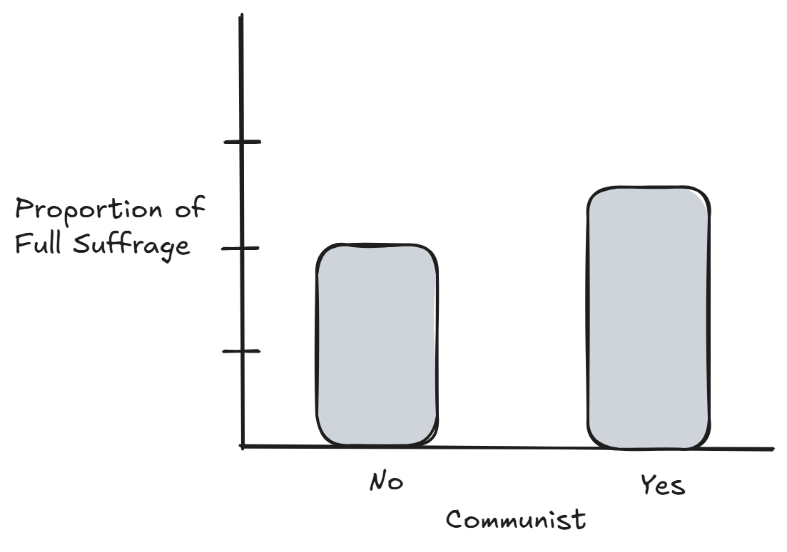
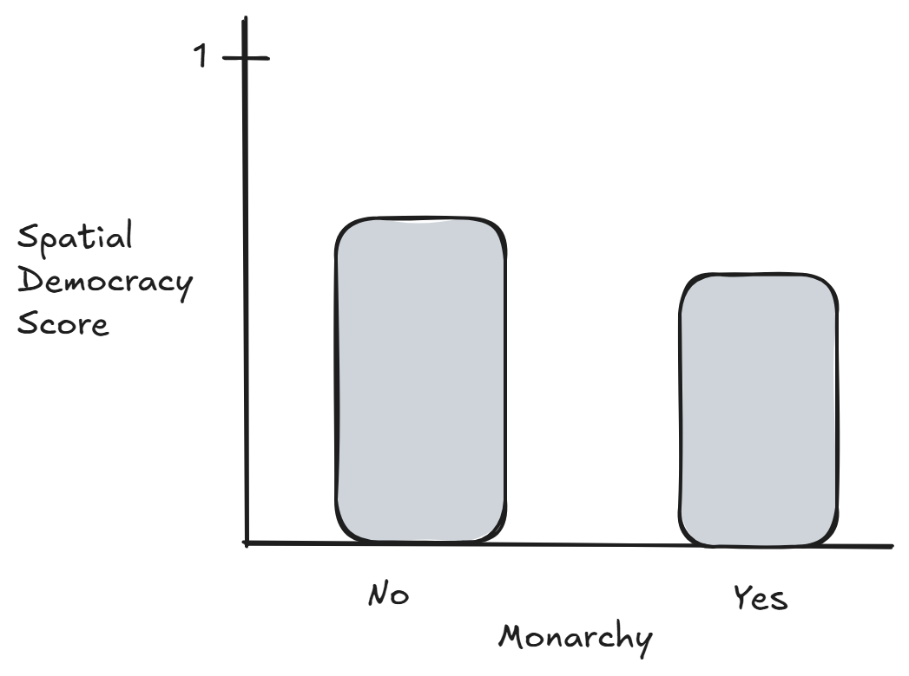

# Context of the Data

This dataset comes from the TidyTuesday project and contains information about political regimes across countries and time. Each row represents a country and year observation. The dataset includes variables such as regime type, different measures of democracy, suffrage, and other political aspects.

# Load data

```{r}
#| message: false
#| warning: false
democracy_data <- readr::read_csv('https://raw.githubusercontent.com/rfordatascience/tidytuesday/main/data/2024/2024-11-05/democracy_data.csv')
```

# Data cleaning

The data has been cleaned by using the `dplyr` package. Missing values for some columns were entered as "?", so those values are now NA. The columns were renamed to make more sense. Some columns were changed using `mutate` with `dplyr`. Also, the columns that were meant to be logical but were not were changed to logical using `as.logical`.

# Research Questions

-   Is there a relationship between a country being communist and having full suffrage?
-   Is there a relationship between a country being a monarchy and spatial democracy score?
-   Do communist countries go to war more often than non-communist countries?
-   Is there an association between regime category index and GDP?

# Plots

-   Is there a relationship between a country being communist and having full suffrage?

{width="389"}

-   Is there a relationship between a country being a monarchy and spatial democracy score?

{width="389"}
# Project Checkpoint 2

```{r}
library(tidyverse)

mean_spatial_democracy <- function(
  lgl_var,
  spatial_democracy = democracy_data$spatial_democracy
) {
  valid <- !is.na(lgl_var)

  true_mean <- mean(spatial_democracy[valid & lgl_var], na.rm = TRUE)
  false_mean <- mean(spatial_democracy[valid & !lgl_var], na.rm = TRUE)

  c("TRUE" = true_mean, "FALSE" = false_mean)
}

vars <- c(
  "is_monarchy",
  "is_commonwealth",
  "is_female_monarch",
  "is_democracy",
  "is_presidential",
  "is_interim_phase",
  "is_female_president",
  "is_colony",
  "is_communist",
  "has_proportional_voting",
  "has_full_suffrage",
  "is_multiparty",
  "has_free_and_fair_election"
)

result <- map_dfr(vars, function(var) {
  res <- mean_spatial_democracy(democracy_data[[var]])

  tibble(
    variable = var,
    mean_true = res["TRUE"],
    mean_false = res["FALSE"]
  )
})

result
```

